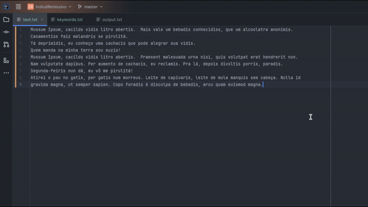

# Indice Remissivo
Projeto Indice Remissivo. Estrutura de Dados - Ciência da Computação UNIFOR 2024.1  
Um programa que interpreta um arquivo de texto e indica as linhas onde foram encontradas certas palavras especificadas.
Feito utilizando estruturas de dados como Árvore Binária de Buscas, Linked Lists e Hash Tables.



# Exemplo de uso

## Entrada

<ins>text.txt</ins>
```
“Good programming is not learned from  
generalities, but by seeing how significant  
programs can be made clean, easy to  
read, easy to maintain and modify,  
human-engineered, efficient, and reliable,  
by the application of common sense and  
by the use of good programming practices.”
```

<ins>keywords.txt</ins>
```
programming
programs
easy
by
human-engineered
and
be
to
```

## Saída

<ins>output.txt</ins>
```
and 4 5 6
be 3
by 2 6 7
easy 3 4
human-engineered 5
programming 1 7
programs 3
to 3 4
```

# Referências
- [Geeks for Geeks: Implementing our own hash table with separate chaining in java](https://www.geeksforgeeks.org/implementing-our-own-hash-table-with-separate-chaining-in-java/)
